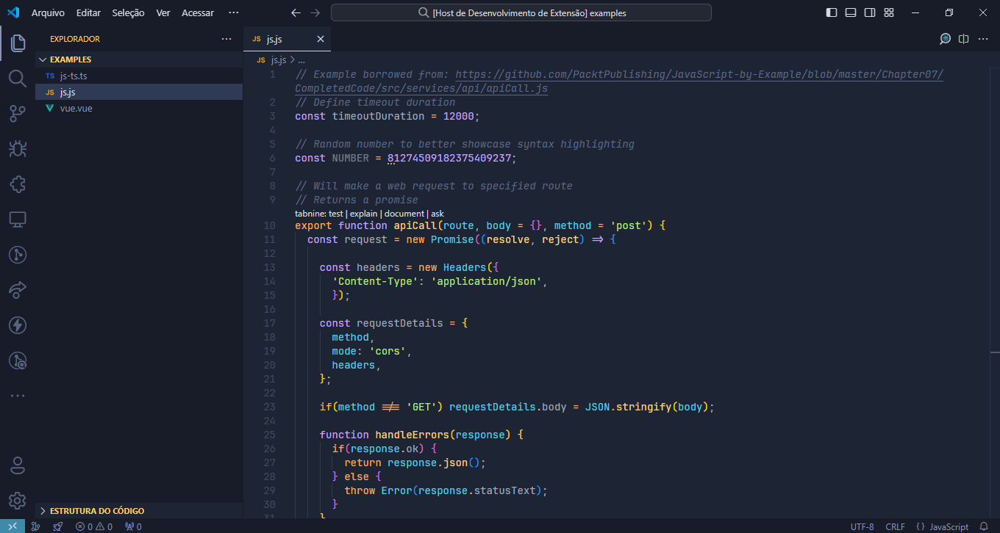

    
    <h2 align="center">Sakai Theme</h2>

All natural pine, faux fur and a bit of soho vibes for the classy minimalist

    

## Usage

1. Open VSCode
2. Search for `Sakai Theme` in extensions
3. Install the theme and choose your variant in `Preferences: Color theme`
4. Optionally enable the included icon theme in `Preferences: File Icon Theme`

## Gallery

> Font used is [JetBrains](https://www.jetbrains.com/lp/mono/)

**Sakai Theme Jupiter**

**Sakai Theme Moon**

**Sakai Theme Saturn**

**Sakai Theme Sun**

**Sakai Theme Uranus**

